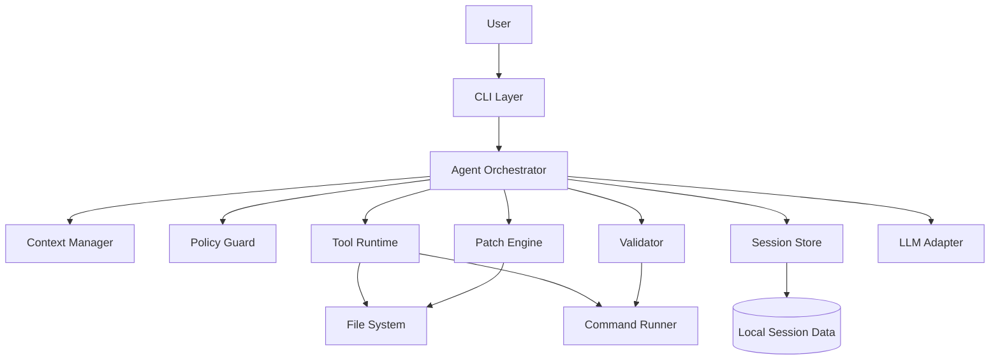
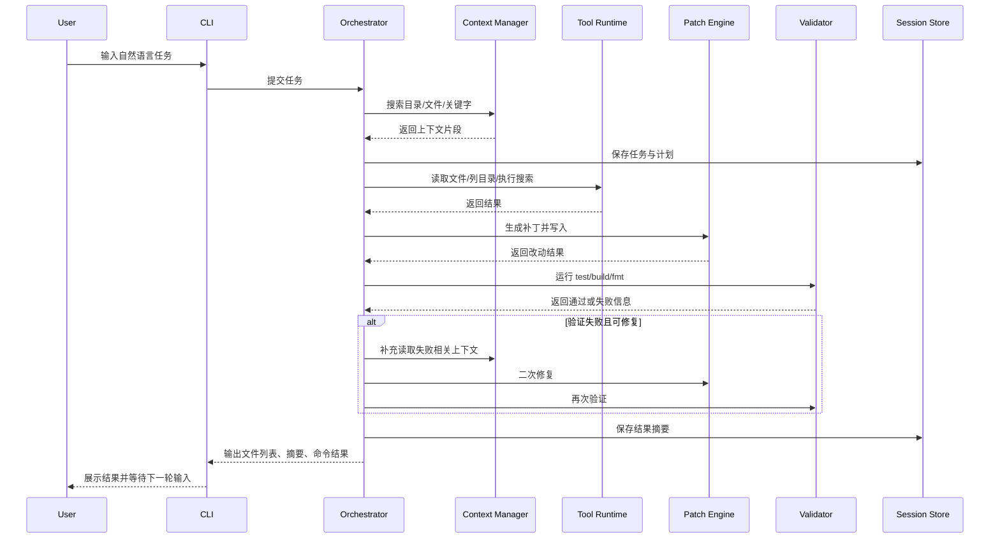

# GoCode 架构设计文档

## 1. 文档目标

本文基于 `prd.md` 中的 MVP 需求，为 `GoCode` 提供一份可落地的系统架构设计，目标是支持本地 CLI 代码代理完成如下闭环：

- 读取代码与项目结构
- 理解用户任务并生成执行计划
- 修改、创建、删除、移动文件
- 执行受控命令并读取结果
- 根据结果进行一次或多次修复
- 输出变更摘要，并支持继续追问

该架构优先满足 `MVP v0.1` 的 P0 能力，同时为后续的 Git 辅助、`/undo`、更强重构能力预留扩展点。

## 2. 设计目标与原则

### 2.1 架构目标

- 支持单机、本地工作区内的安全执行
- 支持自然语言到工具执行的完整链路
- 支持补丁式修改，避免整文件覆盖
- 支持测试或构建失败后的自动再修复
- 支持会话连续性，便于用户多轮追问
- 保证关键动作可审计、可解释、可确认

### 2.2 设计原则

结合 PRD 中的产品原则，系统设计遵循以下约束：

1. 可控优先于全自动：高风险动作必须进入确认流程。
2. Patch 优先于重写：尽量使用局部修改，减少误伤。
3. 先读后改：变更前必须先完成上下文收集。
4. 工作区隔离：只允许操作当前工作目录。
5. 全链路可观测：每一步工具调用、写入、校验都要记录。
6. 失败可恢复：出现错误时必须返回明确原因，并保留中间状态。

## 3. 总体架构

### 3.1 分层架构

系统采用分层 + 编排核心的结构：



### 3.2 核心分层说明

- `CLI Layer`：负责接收用户输入、展示计划、展示 diff、处理确认与会话命令。
- `Agent Orchestrator`：系统核心，负责理解任务、生成计划、驱动工具执行与修复循环。
- `Context Manager`：负责目录、文件、搜索结果的筛选与上下文预算控制。
- `Policy Guard`：负责风险判断、路径校验、命令白名单、确认门禁。
- `Tool Runtime`：统一封装文件系统工具与命令执行能力。
- `Patch Engine`：负责差异生成、局部补丁应用、写入前校验与回显。
- `Validator`：运行测试、构建、格式化，并解析失败结果供下一轮修复使用。
- `Session Store`：保存本轮会话状态、操作日志、上下文摘要、变更记录。
- `LLM Adapter`：抽象模型调用，隔离 Prompt、Tool Call Schema 和模型供应商差异。

## 4. 逻辑视图

### 4.1 主流程



### 4.2 关键流程特点

- 所有写操作都由 `Patch Engine` 或 `File Writer` 统一落盘，避免多处直接写文件。
- 校验流程由 `Validator` 独立负责，方便后续加入更多命令类型与规则。
- 风险控制在执行前由 `Policy Guard` 拦截，而不是在工具内部零散判断。
- 会话状态由 `Session Store` 保存，为 `/plan`、`/files`、继续追问提供基础。

## 5. 模块设计

## 5.1 CLI Layer

### 职责

- 接收自然语言任务输入
- 处理 `/plan`、`/diff`、`/files`、`/undo`、`/exit` 等命令
- 展示执行计划、工具调用进度、确认提示与最终结果
- 处理高风险操作确认

### 建议实现

- 支持两种模式：
  - `interactive repl`：持续会话模式
  - `one-shot`：一次性命令模式，如 `gocode "修复登录测试"`
- 输出采用结构化块，固定包含：
  - 当前理解的任务
  - 执行计划
  - 调用的工具
  - 涉及文件
  - 变更摘要
  - 命令结果
  - 完成状态或待确认事项

### 关键接口

```go
type UI interface {
    ReadInput(ctx context.Context) (string, error)
    ShowPlan(plan ExecutionPlan)
    ShowResult(result TaskResult)
    AskForConfirmation(req ConfirmRequest) (bool, error)
    ShowProgress(event ProgressEvent)
}
```

## 5.2 Agent Orchestrator

### 职责

- 将自然语言任务转换为结构化目标
- 规划执行步骤
- 驱动上下文收集、工具调用、补丁写入与校验
- 处理失败后的再修复循环
- 维护本轮状态机

### 子模块拆分

- `Task Analyzer`：识别任务意图，如新增、修改、删除、运行、重构。
- `Planner`：生成步骤序列与依赖关系。
- `Executor`：按照计划执行每一步，并收集结果。
- `Repair Loop`：在验证失败时，基于错误信息进入下一轮修复。
- `Result Summarizer`：生成对用户可读的变更摘要。

### 状态机建议

```text
Idle
 -> Planning
 -> GatheringContext
 -> Executing
 -> Validating
 -> Repairing (optional, repeat <= N)
 -> Summarizing
 -> Completed / Failed / AwaitingConfirmation
```

### 设计要点

- 同一轮任务最多执行有限次数修复，例如 `N=2`，防止失控循环。
- Planner 输出的每一步都需要显式标记：
  - 目标
  - 依赖上下文
  - 预计工具
  - 是否高风险
  - 成功判定方式

## 5.3 Context Manager

### 职责

- 管理工作区扫描、文件读取、全文搜索
- 控制上下文窗口大小与文件读取数量
- 为 LLM 提供高价值、低冗余的上下文片段
- 保存本轮任务相关的候选文件集合

### 关键能力

- `Workspace Index`：轻量级目录索引，记录路径、文件类型、修改时间。
- `Search Service`：按关键词、路径、符号进行检索。
- `Snippet Extractor`：只提取相关片段而非整仓读取。
- `Context Budgeter`：限制单轮读取文件数、总字符数、搜索轮次。

### 上下文策略

- 优先读取用户明确提到的路径。
- 若用户未指定路径，先目录扫描，再关键词搜索，再读取候选文件。
- 对大文件按函数、类、段落进行切片，而非整文件注入。
- 保留最近一次任务涉及的文件列表，支持多轮追问。

## 5.4 Tool Runtime

### 职责

- 统一封装所有本地工具调用
- 提供标准输入输出结构
- 隔离文件系统与命令执行实现细节
- 统一处理超时、错误码、路径规则与日志

### 建议工具接口

```go
type Tool interface {
    Name() string
    Run(ctx context.Context, input ToolInput) (ToolOutput, error)
}

type ToolRuntime interface {
    Execute(ctx context.Context, call ToolCall) (ToolResult, error)
}
```

### MVP 工具实现映射

| PRD 工具 | GoCode 模块实现 |
|---|---|
| `list_dir(path)` | `fs.ListDir` |
| `read_file(path)` | `fs.ReadFile` |
| `search_text(query, path)` | `search.Grep` |
| `write_file(path, content)` | `fs.WriteFile` |
| `apply_patch(path, patch)` | `patch.Apply` |
| `make_dir(path)` | `fs.MakeDir` |
| `move_path(from, to)` | `fs.MovePath` |
| `delete_path(path)` | `fs.DeletePath` |
| `run_command(cmd, cwd)` | `command.Runner` |
| `git_diff()` | `git.DiffProvider` |

### 命令执行规则

- 所有命令必须在工作区根目录或其子目录内执行。
- 命令按白名单分级：
  - 低风险：`go test`, `go build`, `go fmt`
  - 中风险：脚本执行、包管理命令
  - 高风险：删除、系统级命令、网络侧命令
- 需要对命令设置：超时、最大输出长度、退出码捕获。

## 5.5 Patch Engine

### 职责

- 基于上下文生成局部修改补丁
- 将补丁应用到目标文件
- 在落盘前进行基本校验
- 输出变更摘要和 diff 结果

### 核心设计

Patch Engine 统一负责三类写操作：

1. 新文件创建
2. 已有文件局部修改
3. 删除或移动后的引用修复

### 建议实现策略

- 优先生成基于文本锚点的 patch。
- 如果 patch 无法安全应用，再退化为受控整文件重写。
- 每次写入前先对原文件做快照，供失败回滚或审计使用。
- 每次写入后返回：
  - 目标文件
  - 变更类型
  - 行级摘要
  - 是否需要用户确认

### 差异模型

```go
type FileChange struct {
    Path       string
    ChangeType string // create, update, delete, move
    BeforeHash string
    AfterHash  string
    Summary    string
}
```

## 5.6 Validator

### 职责

- 根据任务类型选择验证命令
- 运行测试、构建、格式化
- 解析输出，定位失败原因
- 向 Orchestrator 返回结构化错误信息

### 触发策略

- 新增模块：优先跑相关测试，必要时运行 `go test ./...`
- 修改逻辑：优先跑受影响包测试
- 重构或移动文件：增加编译检查 `go build ./...`
- 无显式验证命令时，至少进行语法或构建级校验

### 输出结构

```go
type ValidationResult struct {
    Passed      bool
    Command     string
    ExitCode    int
    Stdout      string
    Stderr      string
    ErrorHints  []string
    RelatedFile []string
}
```

### 自动修复原则

- 只针对本轮改动引发的问题进行自动再修复。
- 达到最大重试次数后停止，并将原因反馈给用户。
- 修复前要补充读取错误相关文件，而不是盲修。

## 5.7 Policy Guard

### 职责

- 统一识别高风险动作
- 校验路径是否越界
- 管控删除、覆盖、批量移动、危险命令
- 在执行前生成确认请求

### 风险分类

| 动作 | 风险级别 | 处理方式 |
|---|---|---|
| 读文件、搜索、列目录 | 低 | 直接执行 |
| 新建文件、局部修改 | 中 | 记录日志后执行 |
| 覆盖文件、删除文件、移动目录 | 高 | 必须确认 |
| 执行非白名单命令 | 高 | 必须确认或拒绝 |

### 关键规则

- 路径必须 `clean + abs + within workspace`。
- 禁止通过相对路径逃逸工作区。
- 高风险动作在确认前不可落盘。
- 命令禁止直接拼接不可信用户输入。

## 5.8 Session Store

### 职责

- 保存本轮与历史会话信息
- 记录执行计划、工具调用、变更结果、验证结果
- 支持 `/plan`、`/files`、`/diff`、继续追问
- 为未来的 `/undo` 提供最小回退依据

### MVP 存储建议

MVP 阶段优先采用本地文件存储，而不是先引入数据库：

- `session.json`：当前会话元数据
- `events.jsonl`：工具调用与状态事件日志
- `changes/`：写前快照与 diff 结果
- `artifacts/`：命令输出、测试结果、补丁文件

这样实现简单、可调试、易审计，后续再切换 SQLite 也较平滑。

### 数据结构建议

```go
type Session struct {
    ID            string
    WorkspaceRoot string
    StartedAt     time.Time
    LastTask      string
    RelatedFiles  []string
    Plan          ExecutionPlan
    Events        []Event
    Changes       []FileChange
}
```

## 5.9 LLM Adapter

### 职责

- 封装模型请求与响应
- 管理系统提示词、工具描述、输出 schema
- 将模型输出转换为内部计划、补丁、摘要结构
- 支持未来切换不同模型提供商

### 设计建议

- 对外只暴露统一接口，不将具体 SDK 透传到业务层。
- 模型输出尽量结构化，例如 JSON Schema。
- 将 Prompt 分为：
  - 任务理解 Prompt
  - 计划生成 Prompt
  - 代码修改 Prompt
  - 错误修复 Prompt
  - 结果摘要 Prompt

## 6. 核心数据模型

为保证模块解耦，系统内部统一使用结构化数据对象。

### 6.1 任务对象

```go
type Task struct {
    ID          string
    UserInput   string
    Intent      string
    RiskLevel   string
    Workspace   string
    CreatedAt   time.Time
}
```

### 6.2 执行计划

```go
type ExecutionPlan struct {
    Goal        string
    Assumptions []string
    Steps       []PlanStep
}

type PlanStep struct {
    ID             string
    Title          string
    Action         string
    ToolHints      []string
    TargetFiles    []string
    RequiresConfirm bool
    Status         string
}
```

### 6.3 工具调用记录

```go
type ToolCall struct {
    ToolName   string
    Input      map[string]any
    StartedAt  time.Time
    FinishedAt time.Time
}
```

### 6.4 结果对象

```go
type TaskResult struct {
    Completed        bool
    Summary          string
    Files            []string
    Changes          []FileChange
    Validation       []ValidationResult
    NeedsUserDecision bool
}
```

## 7. 目录结构建议

建议采用标准 Go 项目布局，突出 `cmd`、`internal`、`pkg` 的边界。

```text
gocode/
├─ cmd/
│  └─ gocode/
│     └─ main.go
├─ internal/
│  ├─ app/
│  │  └─ runner.go
│  ├─ cli/
│  │  ├─ repl.go
│  │  ├─ command_parser.go
│  │  └─ renderer.go
│  ├─ orchestrator/
│  │  ├─ orchestrator.go
│  │  ├─ planner.go
│  │  ├─ executor.go
│  │  └─ repair_loop.go
│  ├─ context/
│  │  ├─ manager.go
│  │  ├─ indexer.go
│  │  └─ selector.go
│  ├─ tools/
│  │  ├─ runtime.go
│  │  ├─ filesystem/
│  │  ├─ command/
│  │  └─ git/
│  ├─ patch/
│  │  ├─ engine.go
│  │  └─ diff.go
│  ├─ validator/
│  │  ├─ validator.go
│  │  └─ parser.go
│  ├─ policy/
│  │  └─ guard.go
│  ├─ session/
│  │  ├─ store.go
│  │  └─ models.go
│  └─ llm/
│     ├─ adapter.go
│     ├─ prompts/
│     └─ schema/
├─ pkg/
│  └─ types/
├─ testdata/
└─ go.mod
```

## 8. 关键执行流程设计

## 8.1 场景一：新增模块

适用于“新增一个用户模块，包含路由、service 和测试”。

执行步骤：

1. `Task Analyzer` 识别为“新增 + 多文件生成”。
2. `Context Manager` 读取相关目录结构与已有模块范式。
3. `Planner` 输出创建文件列表与依赖关系。
4. `Patch Engine` 创建文件并写入内容。
5. `Validator` 运行对应测试或构建命令。
6. 如失败，`Repair Loop` 基于错误继续修复。
7. `Session Store` 记录新增文件与命令结果。

## 8.2 场景二：修改已有逻辑

适用于“把当前登录逻辑改成 JWT，并保持原有接口不变”。

执行步骤：

1. 搜索登录入口、认证中间件、配置项、测试文件。
2. 提取局部上下文并生成变更计划。
3. 使用 patch 修改鉴权逻辑与相关测试。
4. 运行单测和构建。
5. 若失败，追加读取报错位置再修复。

## 8.3 场景三：删除或重命名文件

适用于“删除没用到的工具函数并修复引用”。

执行步骤：

1. 先搜索引用，判断是否真的未使用。
2. 若涉及删除或重命名，进入确认流程。
3. 执行文件操作。
4. 搜索并修复 import/引用。
5. 运行编译或测试确认未破坏工程。

## 8.4 场景四：测试失败自动修复

适用于“运行测试，定位失败原因并修复”。

执行步骤：

1. `Validator` 执行测试命令。
2. 解析失败输出，提取错误文件、行号、断言差异。
3. `Context Manager` 补充读取相关代码与测试。
4. `Patch Engine` 执行修复。
5. 重新运行测试，直到通过或达到重试上限。

## 9. 安全与约束设计

### 9.1 工作区隔离

- 启动时确定 `workspace root`。
- 所有文件路径都必须经过标准化和根路径校验。
- 不允许访问工作区外路径。

### 9.2 命令白名单

- MVP 阶段仅开放少量工程命令。
- 可按语言栈配置白名单，例如 Go 项目默认开放：
  - `go test`
  - `go build`
  - `go fmt`
- 非白名单命令必须经过确认，或直接拒绝。

### 9.3 审计与回退基础

- 每次写入前保存原始快照。
- 每次命令执行记录：命令、目录、耗时、退出码。
- 每轮任务记录所有改动文件。
- 为后续 `/undo` 功能预留快照恢复能力。

## 10. 非功能设计

### 10.1 性能

- 首次响应 `<= 5 秒`：先返回计划或首个动作，不等待全部完成。
- 简单任务完成 `<= 30 秒`：优先小范围搜索与定点验证。
- 搜索与读取要有限流策略，避免全仓大范围扫描。

### 10.2 稳定性

- 所有工具调用都必须返回显式错误。
- 命令执行增加超时与输出截断机制。
- Patch 应用失败时提供降级路径与原因。

### 10.3 可观测性

- 输出统一事件流：`plan_created`、`tool_started`、`tool_finished`、`patch_applied`、`validation_failed` 等。
- 支持调试模式打印原始工具请求与响应摘要。

## 11. 技术选型建议

结合 Go 生态和 MVP 目标，建议如下：

- CLI：`cobra` 或标准库 `flag` + 自定义 REPL
- 配置：`viper` 或轻量本地配置解析
- 结构化日志：`slog`
- 文件 diff/patch：优先自研文本 patch 应用，必要时结合成熟 diff 库
- 搜索：优先调用本地 `ripgrep`，并提供纯 Go 后备实现
- 命令执行：标准库 `os/exec`
- 会话存储：本地 JSON / JSONL，后续可升级 SQLite

MVP 阶段不建议过早引入复杂消息队列、远程执行框架或多 Agent 基础设施。

## 12. MVP 落地顺序

### 阶段一：打通主链路

- CLI 输入输出
- LLM 调用
- 文件读取、搜索、写入
- 基础任务规划

### 阶段二：补丁修改与结果展示

- Patch Engine
- Diff 摘要
- 文件列表与命令结果展示

### 阶段三：验证与自动修复

- Validator
- 错误解析
- Repair Loop

### 阶段四：安全与会话能力

- Policy Guard
- 风险确认
- Session Store
- `/plan`、`/files`、`/diff`

## 13. 风险点与缓解方案

| 风险 | 描述 | 缓解方案 |
|---|---|---|
| 上下文过多 | 大仓库下读取失控，模型噪声高 | 引入上下文预算和候选文件排序 |
| Patch 失败 | 锚点漂移或格式变化导致无法应用 | 保留回退机制，并允许受控整文件重写 |
| 命令风险 | 错误执行危险命令或越权路径 | 白名单 + 路径校验 + 用户确认 |
| 自动修复失控 | 多轮修复可能越改越乱 | 限制重试次数，只修本轮问题 |
| 多轮会话漂移 | 历史上下文过期导致错误理解 | 保存结构化摘要，而非累积全部原文 |

## 14. 验收映射

本文架构可直接映射到 PRD 的 5 个 MVP 验收场景：

1. 多文件新增：由 `Planner + Patch Engine + Validator` 负责闭环。
2. 定点修改：由 `Context Manager + Patch Engine` 保证补丁式修改。
3. 删除或重命名：由 `Policy Guard + Tool Runtime` 保证确认后执行。
4. 测试失败修复：由 `Validator + Repair Loop` 负责自动再修复。
5. 连续追问：由 `Session Store + Context Manager` 负责上下文承接。

## 15. 结论

`GoCode` 的 MVP 架构应以 `Agent Orchestrator` 为核心，围绕 `Context Manager`、`Tool Runtime`、`Patch Engine`、`Validator` 和 `Session Store` 建立完整执行闭环。该方案既能满足 PRD 要求的本地 CLI 代码代理能力，也保留了后续扩展 Git 辅助、`/undo`、更强重构能力与更安全执行策略的空间。

在实现优先级上，应先确保“读代码 -> 找位置 -> 改代码 -> 跑验证 -> 返回结果”的主流程稳定跑通，再逐步补强风险控制、会话连续性与可观测性。
