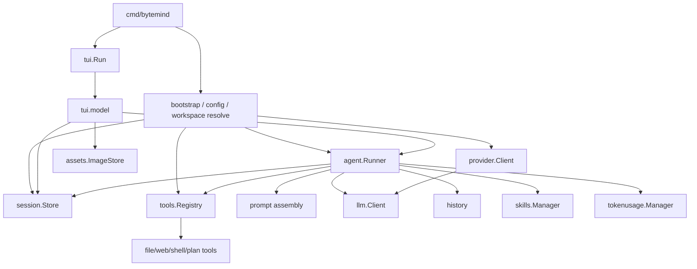

# ByteMind 架构设计文档

## 1. 文档目标

本文档描述 ByteMind 当前仓库实现对应的系统架构，目标是：

- 给后续重构、功能扩展和测试补强提供统一的架构基线。
- 说明当前系统的核心模块、主调用链、关键状态和持久化方式。
- 明确哪些能力已经落地，哪些属于现阶段的实现约束。

本文档以当前代码为准，优先描述“已经存在的真实架构”，而不是理想化终态。

## 2. 系统定位

ByteMind 是一个以 Go 实现的 AI Coding CLI/TUI。它围绕“在本地工作区内与大模型协作完成分析、修改、验证任务”这一主线，提供以下核心能力：

- CLI 与 TUI 双入口。
- 多轮会话与会话恢复。
- Build / Plan 两种工作模式。
- 工具调用循环。
- Provider 适配层，当前支持 OpenAI-compatible 与 Anthropic。
- Prompt 组装、技能注入、仓库级 `AGENTS.md` 指令注入。
- Prompt 历史、会话快照、图片资产、Token 使用统计等配套能力。

## 3. 总体架构

从分层上看，当前系统可以概括为 4 层：

1. 入口与交互层：`cmd/bytemind`、`internal/tui`
2. Agent 编排层：`internal/agent`
3. 领域模型层：`internal/llm`、`internal/plan`、`internal/skills`
4. 基础设施层：`internal/provider`、`internal/tools`、`internal/session`、`internal/history`、`internal/assets`、`internal/config`、`internal/tokenusage`、`internal/mention`

## 4. 模块职责

### 4.1 `cmd/bytemind`

职责：

- 解析 `chat` / `tui` / `run` / `install` 等命令。
- 解析运行时参数，如 `-config`、`-model`、`-session`、`-workspace`、`-max-iterations`。
- 解析工作区根目录，避免默认落在过宽目录。
- 加载配置、初始化 Session Store、Provider Client、Tools Registry、Runner。
- 为 TUI 场景决定是否启用启动引导（startup guide）。

它本质上是应用启动器，不承担对话执行逻辑。

### 4.2 `internal/tui`

职责：

- 承载终端 UI 状态机与渲染逻辑。
- 维护当前输入框、聊天区、会话列表、帮助面板、命令面板、审批提示等界面状态。
- 监听 `agent.Event`，将 Runner 的执行过程投影为界面更新。
- 处理快捷命令、技能切换、BTW 中断、Prompt 历史搜索、输入中的文件 mention、图片粘贴等交互。
- 在首次配置缺失时，提供 API Key / Provider 配置引导。

当前 `internal/tui/model.go` 是 UI 状态、交互行为和部分应用编排的集中承载点。

### 4.3 `internal/agent`

职责：

- 作为核心执行编排器，管理一次 Prompt 运行的完整生命周期。
- 写入用户消息并持久化到 Session。
- 组装系统 Prompt。
- 根据模式和技能策略过滤可用工具。
- 调用 LLM，处理流式输出、工具调用和工具结果回填。
- 维护 Plan 模式状态。
- 触发自动压缩长会话上下文。
- 输出事件流供 TUI 订阅。
- 记录 Token 使用量。

`Runner` 是当前系统的核心应用服务。

### 4.4 `internal/llm`

职责：

- 提供统一消息模型 `Message`、`Part`、`ToolCall`、`ToolDefinition`、`Usage`。
- 定义 Provider 适配后的通用 `Client` 接口。
- 处理消息规范化、校验、模型能力裁剪。
- 为上层屏蔽不同 Provider 的消息格式差异。

这一层是系统中的“统一协议层”。

### 4.5 `internal/provider`

职责：

- 将 `llm.ChatRequest` 转换为 OpenAI-compatible / Anthropic 各自的请求格式。
- 将 Provider 响应还原为 `llm.Message`。
- 处理流式响应拼装。
- 提供 Provider 可用性预检查（preflight）。

当前通过 `provider.NewClient(...)` 根据配置选择具体实现。

### 4.6 `internal/tools`

职责：

- 定义统一 Tool 接口。
- 管理工具注册表 `Registry`。
- 根据 Build / Plan 模式及技能策略过滤工具。
- 提供内建工具实现：
  - `list_files`
  - `read_file`
  - `search_text`
  - `web_search`
  - `web_fetch`
  - `write_file`
  - `replace_in_file`
  - `apply_patch`
  - `update_plan`
  - `run_shell`

工具层是 Agent 与工作区、副作用操作之间的统一入口。

### 4.7 `internal/session`

职责：

- 持久化多轮会话。
- 保存消息时间线、模式、计划状态、激活技能等。
- 提供会话列表和恢复能力。

当前实现采用 JSONL 快照文件，每个 session 文件存放在 `BYTEMIND_HOME/sessions/<project-id>/<session-id>.jsonl`。

### 4.8 `internal/history`

职责：

- 追加写入用户 Prompt 历史。
- 为 TUI 的 Prompt 搜索和输入恢复提供数据源。

当前历史文件位于 `BYTEMIND_HOME/cache/prompt_history.jsonl`。

### 4.9 `internal/assets`

职责：

- 管理 TUI 中粘贴或引用的图片资产。
- 为消息中的图片 `asset_id` 提供落盘与回读能力。

当前图片缓存位于 `BYTEMIND_HOME/image-cache/<session-id>/`。

### 4.10 `internal/skills`

职责：

- 从内建目录、用户目录、项目目录发现技能。
- 合并覆盖关系并生成目录索引。
- 解析 `skill.json` 与 `SKILL.md`。
- 向 Runner 提供可用技能列表与技能详情。

技能用于约束工作流焦点与工具策略，不直接替代主系统 Prompt。

### 4.11 `internal/plan`

职责：

- 定义 Build / Plan 模式的状态结构。
- 提供步骤、阶段、风险等级的标准化函数。
- 为 `update_plan` 工具与 TUI 计划展示提供统一模型。

### 4.12 `internal/tokenusage`

职责：

- 记录 session 级 Token 使用情况。
- 维护实时统计和历史统计。
- 支持内存、文件、数据库多种存储后端。
- 为 TUI 的 Token 展示提供聚合视图。

### 4.13 `internal/config`

职责：

- 管理默认配置、用户配置、项目配置和环境变量覆盖。
- 管理 `BYTEMIND_HOME` 目录布局。
- 提供首次启动时对配置文件的创建与增量更新能力。

### 4.14 `internal/mention`

职责：

- 建立工作区文件索引。
- 为 TUI 输入框中的 `@path` 补全提供搜索与排序能力。

## 5. 核心运行流程

### 5.1 启动流程

1. `cmd/bytemind` 解析命令行参数。
2. 解析工作区根目录。
3. 从默认值、用户配置、项目配置、环境变量中合成最终配置。
4. 初始化 `session.Store`。
5. 按需创建或恢复 Session。
6. 通过 `provider.NewClient(...)` 构造 `llm.Client`。
7. 构造 `tools.Registry`。
8. 构造 `agent.Runner`。
9. 若为 TUI，继续构造 `assets.ImageStore` 并启动 Bubble Tea 程序。

### 5.2 单次 Prompt 执行流程

1. TUI 或 CLI 将用户输入包装为 `llm.Message`。
2. `Runner` 标准化消息并写入 `session.Session.Messages`。
3. Session 快照持久化到磁盘。
4. 用户 Prompt 同步追加到 `history`。
5. `Runner` 根据当前模式、技能、工具清单和 `AGENTS.md` 组装系统 Prompt。
6. 若识别到“显式联网/源码站点查询”诉求，会额外插入一条系统消息，强制优先使用 web 工具。
7. `Runner` 根据模型能力裁剪请求格式与工具集。
8. 调用 `llm.Client.CreateMessage` 或 `StreamMessage`。
9. 若模型返回文本答案，则保存 assistant 消息并结束本轮。
10. 若模型返回工具调用，则逐个执行 Tool：
    - 生成 `ExecutionContext`
    - 执行 Tool
    - 记录结果
    - 将 tool result 重新写回 Session
11. 进入下一轮模型调用，直到：
    - 得到最终答案
    - 达到最大迭代次数
    - 检测到重复工具序列

### 5.3 Plan 模式流程

Plan 模式本质上仍走同一条 Runner 主循环，但额外包含以下特征：

- 运行模式会被标准化为 `plan`。
- Session 内维护 `plan.State`。
- `update_plan` 工具可直接更新计划状态。
- 当模型想结束回答但没有形成结构化计划时，Runner 会补充提醒，要求先用 `update_plan` 输出结构化计划。
- TUI 订阅 `EventPlanUpdated` 事件以同步界面中的 plan 状态。

## 6. Prompt 组装设计

Prompt 组装逻辑位于 `internal/agent/prompt.go`，当前固定顺序为：

1. `internal/agent/prompts/system_prompt.md`
2. `internal/agent/prompts/mode/{build|plan}.md`
3. 运行时上下文块
4. 当前激活技能块
5. 工作区根目录中的 `AGENTS.md`

对应的更详细说明见 `docs/prompt-architecture.md`。

当前设计要点：

- 系统 Prompt 是“模板 + 运行时上下文”的组合，而不是硬编码字符串。
- 技能是会话级附加约束，而不是 Provider 特化分支。
- 仓库级 `AGENTS.md` 作为最后注入的指令块，用于覆盖项目内的协作规则。

## 7. 状态与数据持久化

### 7.1 Session

Session 是当前系统最核心的持久化对象，保存：

- 会话 ID
- 工作区
- 消息时间线
- 当前模式
- 计划状态
- 激活技能

Session 是运行恢复、上下文延续和多轮交互的事实来源。

### 7.2 Prompt 历史

Prompt 历史与 Session 分离保存，目的是：

- 让“输入历史搜索”不依赖会话完整加载。
- 支持跨 Session、跨工作区的 Prompt 检索。

### 7.3 图片资产

图片不直接内嵌进 Session 快照，而是：

- Session 中存 `asset_id`
- 图片二进制由 `assets.ImageStore` 单独缓存

这种做法避免会话快照无限膨胀。

### 7.4 Token 使用量

Token 使用量与会话正文解耦，独立交给 `internal/tokenusage` 管理，便于：

- 做长期统计
- 替换存储后端
- 为 UI 提供聚合数据

## 8. 关键设计决策

### 8.1 以 `llm` 作为统一协议层

系统没有让上层直接感知 OpenAI / Anthropic 的消息差异，而是统一到 `llm.Message`、`llm.ToolCall`、`llm.ToolDefinition` 等结构上。这保证了：

- Prompt / Tool / Session 的上层逻辑基本与 Provider 解耦。
- 新增 Provider 的主要工作集中在 `internal/provider`。

### 8.2 以 `Runner` 作为唯一执行编排入口

当前所有一次任务运行的关键动作都收敛到 `Runner`：

- Prompt 组装
- 会话持久化
- Tool Loop
- Plan 更新
- 自动压缩
- Token 记录

这使得 CLI 与 TUI 可以共享同一套执行语义。

### 8.3 工具能力通过 Registry 统一暴露

`internal/tools` 让模型看见的工具、工具定义和工具执行入口保持一致，避免把文件、Shell、Web、Plan 等能力分散到多处编排。

### 8.4 Session 是恢复能力的中心

模式、计划、激活技能都保存在 Session 中，而不是只放在内存里。这让：

- `/resume`
- TUI 恢复
- 长任务中断后继续

都建立在同一份状态之上。

## 9. 当前实现约束

当前版本有以下架构性约束：

- UI 状态和大量交互行为集中在 `internal/tui/model.go`。
- Agent 编排职责集中在 `internal/agent/runner.go`。
- Plan 面板渲染链路已经存在，但当前 `hasPlanPanel()` 返回 `false`，说明 Plan 侧边栏能力尚未真正启用。
- Token 使用统计是增强能力，不影响主链路；底层存储初始化失败时会优雅降级到内存实现。
- Provider 预检查主要发生在 TUI 启动引导场景，CLI 一次性执行路径更偏向“直接运行”。

这些约束并不影响当前产品可用性，但会影响后续演进速度和模块扩展成本。

## 10. 测试与质量保障

当前仓库已经为多个关键包建立测试：

- `internal/agent`
- `internal/provider`
- `internal/tools`
- `internal/session`
- `internal/config`
- `internal/assets`
- `internal/history`
- `internal/llm`
- `internal/tui`

其中最值得持续保持覆盖的链路是：

- Prompt 组装顺序
- Tool Loop 分支
- Build / Plan 模式切换
- Session 序列化与恢复
- Provider 适配差异
- Web / Shell / Patch 等高副作用工具的约束行为

## 11. 后续架构演进原则

后续演进建议持续遵守以下原则：

- 保持 `llm` 统一协议层稳定。
- 保持 Prompt 组装顺序稳定，避免 Provider 特化分叉。
- 对高副作用能力继续通过工具层统一治理。
- 对用户可恢复状态优先落 Session，而不是只保存在内存。
- 重构应优先保护 CLI/TUI 共享的执行语义一致性。

## 12. 结论

ByteMind 当前架构已经具备一个可工作的 Coding Agent 最小闭环：

- 上层有 CLI/TUI 交互入口
- 中间有统一的 Runner 编排
- 下层有 Provider、Tools、Session、History、Assets、Skills 等支撑模块

它的特点是“先把主链路打通，再逐步增强模块边界”。因此，这份架构设计文档的价值不在于证明系统已经高度模块化，而在于明确当前真实边界、真实依赖和真实事实来源，为后续低风险演进提供共同参照。
